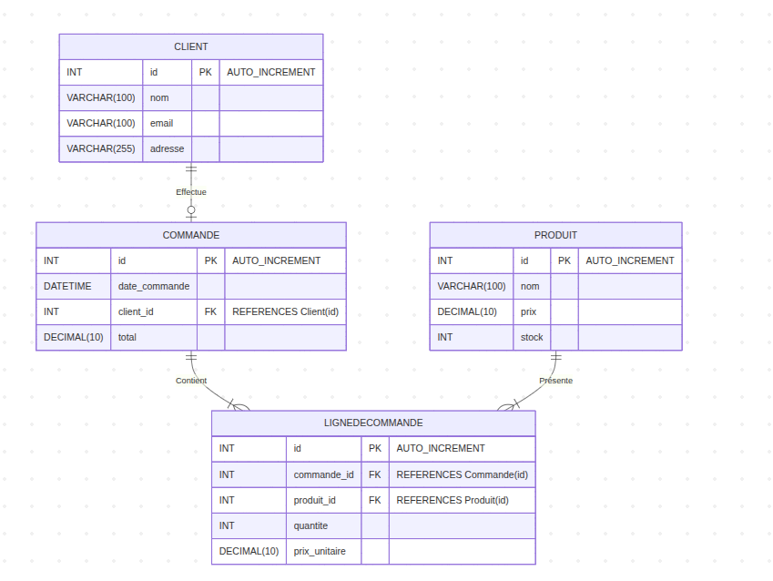
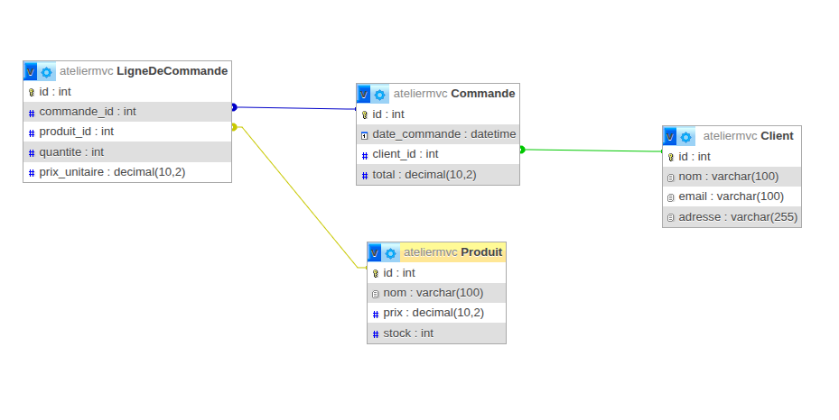
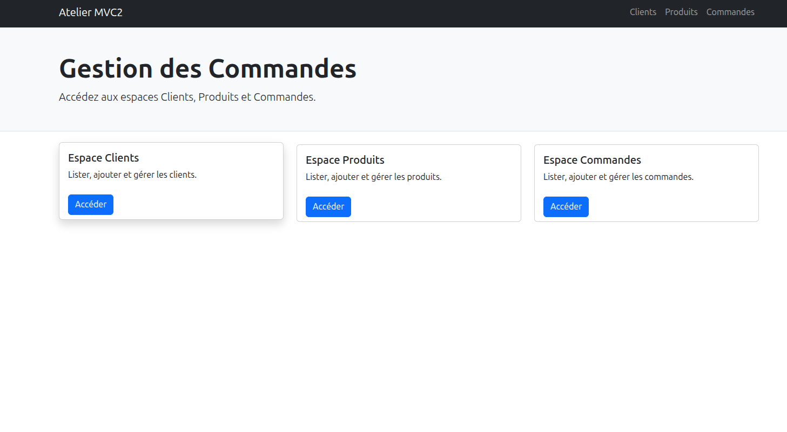
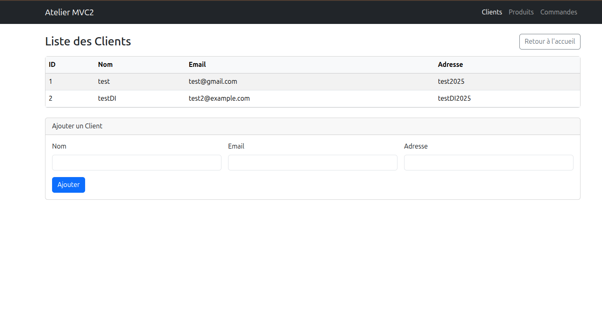
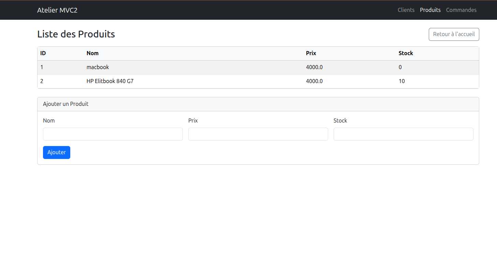
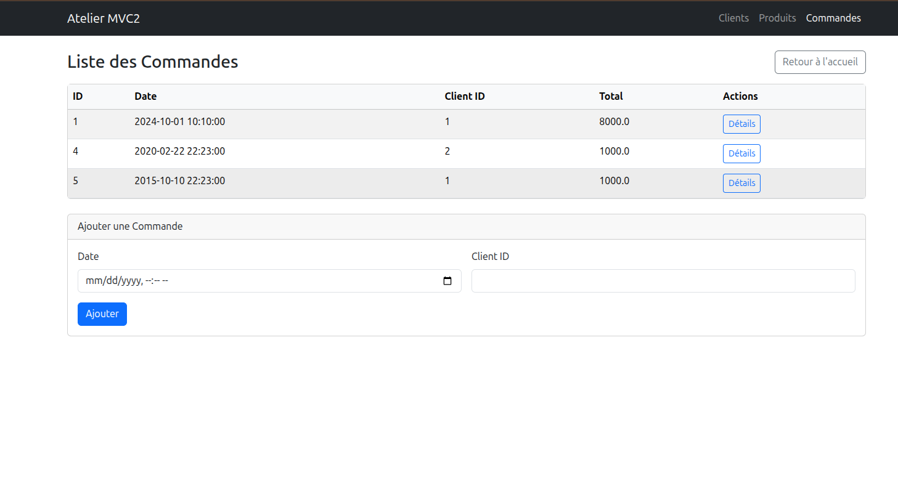
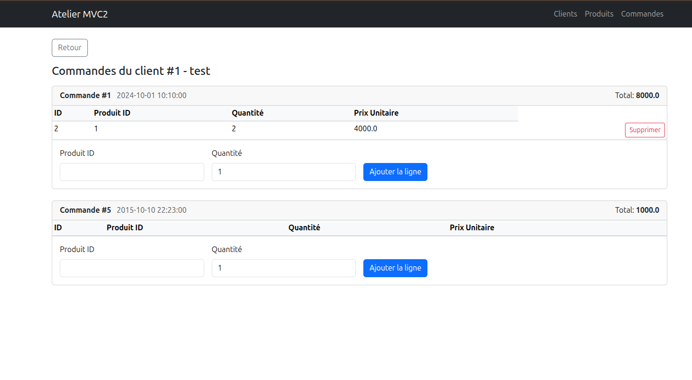

# Application web MVC2 - Gestion des Commandes (Servlet/JSP/DAO/CDI)

Ce mini-rapport documente les étapes de réalisation de l'application MVC2 conforme aux standards Jakarta EE (Servlet, JSP, JavaBeans, DAO) avec injection de dépendances CDI.

## 1. Diagramme UML (Classes)

Placez ici une capture d'écran du diagramme de classes (Client, Produit, Commande, LigneDeCommande):



- Client(client_id, nom, email, adresse)
- Produit(id, nom, prix, stock)
- Commande(commande_id, date_commande, client_id, total)
- LigneDeCommande(id, commande_id, produit_id, quantite, prix_unitaire)

Relations:
- Une Commande appartient à un Client
- Une LigneDeCommande appartient à une Commande et référence un Produit

## 2. Schéma de base de données (MySQL)

Placez ici une capture d'écran phpMyAdmin du schéma et/ou des tables:



SQL utilisé (extrait):
```
CREATE TABLE Client (
  id INT AUTO_INCREMENT PRIMARY KEY,
  nom VARCHAR(100) NOT NULL,
  email VARCHAR(100),
  adresse VARCHAR(255)
);

CREATE TABLE Produit (
  id INT AUTO_INCREMENT PRIMARY KEY,
  nom VARCHAR(100) NOT NULL,
  prix DECIMAL(10,2) NOT NULL,
  stock INT DEFAULT 0
);

CREATE TABLE Commande (
  id INT AUTO_INCREMENT PRIMARY KEY,
  date_commande DATETIME DEFAULT CURRENT_TIMESTAMP,
  client_id INT,
  total DECIMAL(10,2) DEFAULT 0,
  FOREIGN KEY (client_id) REFERENCES Client(id) ON DELETE SET NULL
);

CREATE TABLE LigneDeCommande (
  id INT AUTO_INCREMENT PRIMARY KEY,
  commande_id INT,
  produit_id INT,
  quantite INT DEFAULT 1,
  prix_unitaire DECIMAL(10,2),
  FOREIGN KEY (commande_id) REFERENCES Commande(id) ON DELETE CASCADE,
  FOREIGN KEY (produit_id) REFERENCES Produit(id) ON DELETE SET NULL
);
```

## 3. Création des entités (JavaBeans)

Dossier: `src/main/java/ma/fstt/entities`

- `Client.java`, `Produit.java`, `Commande.java`, `LigneDeCommande.java`
- POJOs simples avec getters/setters correspondant aux colonnes de la base

## 4. Couche DAO (Data Access Object)

Dossier: `src/main/java/ma/fstt/dao`

- `DAO<T>`: classe abstraite générique
- `ClientDAO`, `ProduitDAO`, `CommandeDAO`, `LigneCommandeDAO`
  - CRUD basiques via JDBC
  - Méthodes utilitaires: `findByCommandeId`, `sumTotalByCommandeId` (lignes)

Connexion BD via CDI:
- `DBConfig` fournit un `@Produces @RequestScoped Connection`
- `DAO` injecte `Connection` (`@Inject protected Connection connection`)

## 5. Services (Business Layer)

Dossier: `src/main/java/ma/fstt/service`

- Interfaces: `ClientInterface`, `ProduitInterface`, `CommandeInterface`
- Implémentations `@ApplicationScoped`: `ClientService`, `ProduitService`, `CommandeService`
  - Injection des DAO via `@Inject`
  - Constructeur sans argument pour proxyabilité CDI

## 6. Contrôleurs (Servlets)

Dossier: `src/main/java/ma/fstt/controller`

- `ClientController` (`/clients`): liste et ajout de clients
- `ProduitController` (`/produits`): liste et ajout de produits
- `CommandeController` (`/commandes`):
  - liste des commandes
  - création d'une commande (total initial à 0, validation FK client)
- `LigneCommandeController` (`/lignes`):
  - GET: `clientId` obligatoire, liste les commandes du client et leurs lignes
  - POST action=add-line: validation FK (client, commande du client, produit), auto-prix depuis `Produit`, contrôle/MAJ de stock, recalcul et MAJ du total de la commande
  - POST action=delete-line: suppression ligne, restock produit, recalcul total

Gestion d'erreurs:
- Contraintes FK capturées et affichées dans les JSP (messages `error`)

## 7. Vues (JSP + JSTL + Bootstrap)

Dossier: `src/main/webapp`

- `index.jsp`: page d'accueil (dashboard) avec cartes vers Clients/Produits/Commandes
- `views/client/list.jsp`: table + formulaire d'ajout
- `views/produit/list.jsp`: table + formulaire d'ajout
- `views/commande/list.jsp`: table + formulaire de création de commande (sans total)
- `views/commande/lignes.jsp`: commandes d'un client, leurs lignes, formulaire d'ajout de ligne, suppression ligne

Captures d'écran  

  

  

  

  

  


Exemples de liens de navigation:
- `/clients`, `/produits`, `/commandes`, `/lignes?clientId=1`

## 8. Injection de dépendances (CDI)

- Fichier `beans.xml` minimal: `src/main/resources/META-INF/beans.xml`
- Producteur `Connection` dans `DBConfig`:
  - `@Produces @RequestScoped Connection produceConnection()`
  - Disposer: `closeConnection(@Disposes Connection connection)`
- DAOs annotés `@ApplicationScoped` et héritent de `DAO` qui injecte `Connection`
- Services `@ApplicationScoped` avec constructeur no-arg pour proxyabilité

## 9. Configuration et dépendances (Maven)

- Packaging: WAR
- Dépendances principales: `jakarta.servlet-api`, `jakarta.servlet.jsp.jstl-api` + impl, `mysql-connector-java`
- CDI fourni par le conteneur (WildFly) + `beans.xml`

## 10. Déploiement et exécution

1. Créer la base `ateliermvc` et exécuter le script SQL.
2. Configurer `DBConfig` (URL, user, password) si besoin.
3. `mvn clean package`
4. Déployer le WAR sur WildFly
5. Accéder à: `http://localhost:8080/atelier1_mvc2-1.0-SNAPSHOT/`

## 11. Parcours utilisateur

- Accueil → Clients/Produits/Commandes
- Créer commande (date + client). Total = 0.
- Détails (Lignes) → ajouter des produits par ID et quantité. Le prix unitaire provient de `Produit`. Le total est recalculé à chaque ajout/suppression.

## 12. Améliorations possibles

- Sélecteur de produit (dropdown) avec nom/prix au lieu d'ID
- Jointures pour afficher noms des produits dans les lignes
- Pagination et recherche
- Sécurité (authentification) et validations côté client

Fait par EL GORRIM MOHAMED en 06/10/2025
